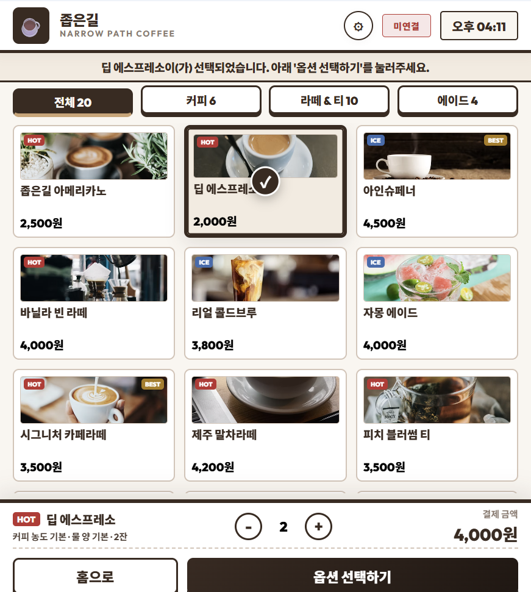
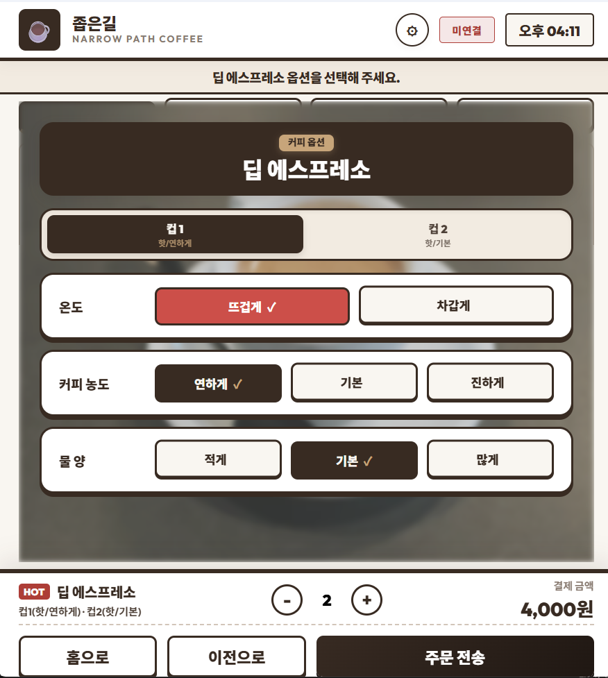
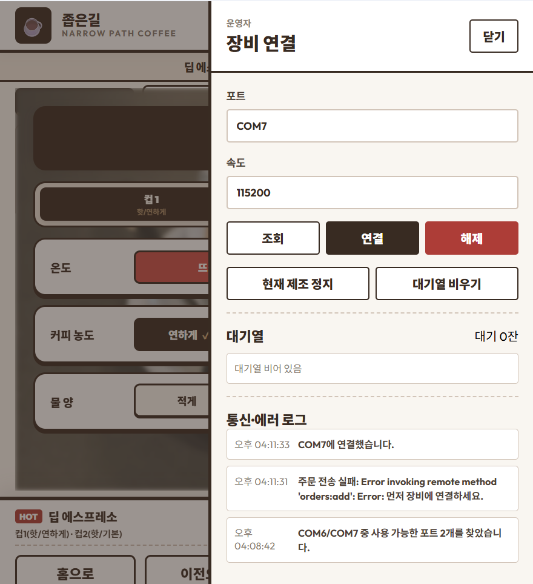
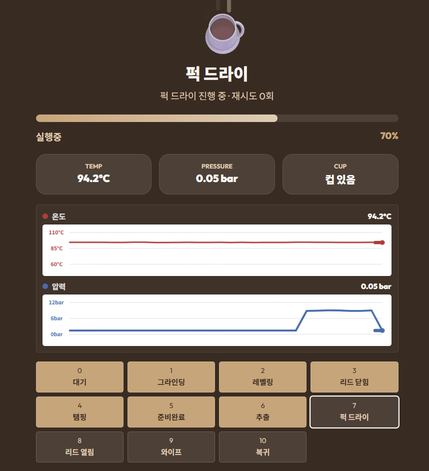

# ☕ 좁은길(Narrow Path) 음료 머신 컨트롤러 (Drink Machine Controller)

Electron과 Vanilla JS/React를 활용하여 제작된 Windows 데스크톱 애플리케이션입니다.  
가상 COM 포트를 통해 커피 머신 시뮬레이터(`machine_sim.exe`)와 Modbus RTU 프로토콜로 연동하여 커피 주문 전송, 실시간 제조 모니터링, 다중 주문 대기열 제어 및 통신 예외 처리를 정밀하게 수행합니다.

---

## 📌 목차
1. [현재 완성 상태 및 기능](#-현재-완성-상태-및-기능)
2. [실제 실행 화면 및 주요 UI](#-실제-실행-화면-및-주요-ui)
3. [사용한 라이브러리 및 기술 스택](#-사용한-라이브러리-및-기술-스택)
4. [실행 및 테스트 환경 준비](#-실행-및-테스트-환경-준비)
5. [빌드 및 실행 방법](#-빌드-및-실행-방법)
6. [Electron 패키징 방법](#-electron-패키징-방법)
7. [자동 테스트 검증 내역](#-자동-테스트-검증-내역)

---

## 🛠️ 현재 완성 상태 및 기능

- **시리얼 포트 통신 및 프로토콜 제어**
  - [x] 가상 시리얼 포트 연결 및 Modbus RTU 통신 프레임 규격 준수
  - [x] CRC-16 Modbus 검증 코드 직접 구현 (체크섬 정밀 대조)
  - [x] Modbus 기능 코드(FC) 완벽 지원: FC03(Read Holding), FC04(Read Input), FC06(Write Single), FC10(Write Multiple)
- **실시간 텔레메트리 모니터링 (100ms 주기 Polling)**
  - [x] 보일러 온도(Temp), 추출 압력(Pressure) 실시간 수치 표기 및 트렌드 그래프 렌더링
  - [x] 컵 안착 상태(`IR.CUP_STATUS`), 머신 작동 모드(`IR.SYS_MODE`), 레시피 추출 단계(`IR.BRW_STAGE`) 가시화
- **정밀 레시피 제어 및 다중 주문 관리**
  - [x] 도징량(Dose, 원두량) 및 추출량(Yield, 물/우유량) 동시 세팅 및 다중 Holding Register 쓰기 기법 활용
  - [x] 주문 수락 여부 자동 검증 (`HR.CMD` 되읽기 및 `0xFFFF` 응답 시 최대 3회 자동 재시도)
  - [x] 선입선출(FIFO) 기반의 대기열 큐(Queue)를 설계하여 다중 잔 주문 제어
  - [x] `추출 완료(RCP_STATE = 2)` 이후 `컵 수령(CUP_STATUS = 0)` 상태까지 감지하여 다음 잔을 안전하게 가동
- **통신 예외 처리 및 오토 리커버리**
  - [x] 순간적인 패킷 누락(지연)과 장기 오프라인 상태(단절)를 구분하여 유연한 경고 표시
  - [x] 통신 두절 지속 시, 메인 프로세스 단에서 직렬 포트를 초기화하고 자동으로 재연결을 시도하는 복구 루틴 작동
  - [x] 현재 제조 중단(`CMD.STOP_ALL`) 및 대기 큐 전체 삭제 기능 지원

---

## 📸 실제 실행 화면 및 주요 UI

### 1. 시작 화면 (Start Screen)

* 앱 시작 시 노출되는 진입부입니다. 모던한 뉴트럴 톤의 웰컴 애니메이션 효과와 함께 터치식 주문 시작 버튼을 제공합니다.

### 2. 메뉴 선택 화면 (Menu Screen)

* 음료 카드 그리드 레이아웃입니다. 음료 이미지, 가격 정보, 특정 음료 뱃지(HOT/ICE/BEST)가 렌더링되며, 카드를 터치해 원하는 잔 수(Stepper) 및 장바구니 구성을 실시간으로 확인합니다.

### 3. 레시피 옵션 설정 화면 (Options Screen)

* 다중 잔 주문 시 상단에 개별 컵(예: 컵 1, 컵 2) 탭이 생성되어 개별 잔마다 온도, 커피 농도, 물/우유 양 등을 독립적으로 정밀하게 세팅할 수 있는 상세 조리 설정 인터페이스입니다.

### 4. 관리자 설정 패널 (Admin Drawer)

* 우측 상단 톱니바퀴 버튼 클릭 시 슬라이딩되는 포트 연결 창입니다. 가상 COM 포트(`COM7`)와 속도(`115200`) 설정, 장비 연결/해제 및 실시간 통신·에러 로그 확인, 대기열 순서 모니터링 등의 장비 진단 명령을 제공합니다.

### 5. 실시간 제조 상태 및 텔레메트리 모니터링 (Brewing/Telemetry Screen)

* 음료 제조 시작 시 노출되는 메인 모니터링 창입니다. 현재 공정 단계(예: "퍽 드라이", 70%), 실시간 온도(94.2°C) 및 압력(0.05 bar), 컵 감지기 상태를 보여주며, 하단 Canvas 차트 영역에 지난 3초간의 실시간 추이를 곡선 그래프로 그려냅니다.

---

## 📦 사용한 라이브러리 및 기술 스택

### Core & Framework
* **Electron (v42.4.1)**: 크로스 플랫폼 데스크톱 컨테이너로, 메인 프로세스(Node.js OS 자원 제어)와 렌더러 프로세스(웹 UI 화면)의 관심사를 분리하여 보안성 높은 시리얼 연동 아키텍처 구축
* **SerialPort (v13.0.0)**: Node.js 네이티브 바인딩을 기반으로 가상 COM 포트와의 RS-485(Serial) 비동기 읽기/쓰기 구현
* **React (v19.2.7) / HTML5 & Vanilla JS**: 실시간 반응형 키오스크 대시보드 화면 설계 및 드로잉 Canvas를 활용한 압력/온도 실시간 차트 렌더링

### Build & Dev Tools
* **Vite (v8.0.16)**: 고속 모듈 번들러를 통한 렌더러 소스 관리 및 핫 리로드(Hot-Reload) 개발 환경 지원
* **TypeScript (v6.0.3)**: 데이터 모델 및 제어 인터페이스 설계에 있어 정적 타입 안정성 확보
* **Electron-Builder (v26.0.0)**: Windows 플랫폼용 독립 실행 포터블 패키지(`.exe`) 빌드

---

## 🔌 실행 및 테스트 환경 준비

### 1. 가상 시리얼 포트 쌍 생성 (com0com)
본 프로젝트는 **`COM6`**과 **`COM7`** 포트 한 쌍을 사용하여 통신을 중계합니다. (시뮬레이터: `COM6`, 키오스크 앱: `COM7`)
관리자 권한으로 명령 프롬프트(CMD)를 실행하여 아래와 같이 가상 포트 세션을 설정합니다.

```cmd
cd "C:\Program Files (x86)\com0com"
setupc.exe change CNCA0 PortName=COM#
change CNCB0 PortName=COM#
change CNCA0 RealPortName=COM6
change CNCB0 RealPortName=COM7
list
```

`list` 실행 결과에 아래와 같이 노출되면 가상 포트 준비가 완료된 것입니다.
```text
CNCA0 PortName=COM#,RealPortName=COM6
CNCB0 PortName=COM#,RealPortName=COM7
```

### 2. 머신 시뮬레이터 구동
PowerShell 또는 CMD 창을 새로 열어 동봉된 시뮬레이터를 구동합니다. (통신 노이즈/장애 시뮬레이션을 위해 `--fault 3` 플래그 사용 권장)
```powershell
cd C:\Users\soong\Downloads\machine_sim
.\machine_sim.exe --port COM6 --baud 115200 --fault 3
```

---

## 🚀 빌드 및 실행 방법

### 개발 모드 실행
프로젝트 루트 폴더로 이동하여 패키지를 설치한 뒤 개발 서버 및 데스크톱 앱을 실행합니다.

```powershell
# 1. 의존성 패키지 설치
npm install

# 2. 일렉트론 애플리케이션 시작
npm start
```

### 앱 내 연결 방법
1. 앱 실행 후 우측 상단의 **톱니바퀴 아이콘(⚙)**을 클릭하여 설정 서랍(Drawer)을 엽니다.
2. 포트 입력란에 **`COM7`**, 속도에 **`115200`**을 입력합니다.
3. **[연결]** 버튼을 누르면 실시간 텔레메트리 데이터가 표기되기 시작합니다.
   * *주의: 시뮬레이터가 `COM6`을 사용 중이므로 앱은 반드시 반대쪽 포트인 `COM7`로 붙어야 정상 통신됩니다.*

---

## 📦 Electron 패키징 방법

애플리케이션을 별도의 설치가 필요 없는 윈도우 단일 포터블 실행 파일(`.exe`)로 패키징할 수 있습니다. `electron-builder`를 구동하여 빌드 아티팩트를 컴파일합니다.

```powershell
npm run package
```

패키징이 성공적으로 끝나면 프로젝트 루트에 `dist/` 폴더가 생성되며, 아래 파일이 만들어집니다:
* **`dist/Drink Machine Controller 1.0.0.exe`** (더블클릭하여 바로 구동 가능)

---

## 🧪 자동 테스트 검증 내역

아래 명령어를 사용하여 기기 제어 로직 및 프로토콜 파싱 예외 시나리오 테스트 코드를 실행할 수 있습니다.

```powershell
npm test
```

### 검증하는 시나리오 및 설계 내역
1. **CRC 검증**: Modbus 통신 패킷에 생성/첨부되는 CRC-16 체크섬 코드가 프로토콜 스펙과 정확히 일치하는지 검증
2. **Modbus 프레임 파싱**: FC03(다중 읽기), FC06(단일 쓰기), FC10(다중 쓰기) 요청 및 응답 프레임이 바이트 단위로 정확히 조립/해석되는지 검증
3. **일시적 통신 노이즈 대응**: 순간적인 패킷 유실 시 즉시 에러 처리를 하지 않고, 정해진 시간 동안 재시도 요청을 보내 정상 복구하는지 테스트
4. **명령 전송 순서**: 도징량/추출량 레시피 설정 기입 ➔ 장치 준비 대기 ➔ 최종 조리 시작 명령(`COFFEE_START`)이 올바른 레지스터 순서로 트리거되는지 확인
5. **비정상 컵 수령 예외 처리**: 음료 추출이 완료되기 전에 사용자가 컵을 꺼냈을 때, 상태 머신에서 이를 안전하게 감지하여 `실패(failed)` 상태로 긴급 중단하는지 검증
6. **컵 수령 후 정상 완료 검증**: 추출이 성공적으로 완료되고 컵이 감지기 밖으로 빠져나갔을 때에만 주문 상태를 `완료(done)`로 판단하고 대기열의 다음 잔을 가져오는지 검증